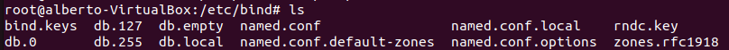
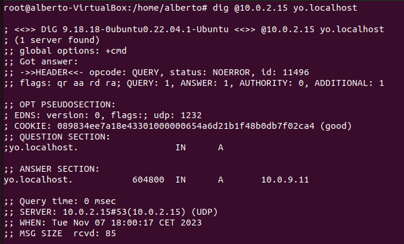

# Instalación de Bind9
Comando para la instalación:

    apt install bin9*
# Vemos el estado de nuestro servicio

    systemctl status bind9
 

# Comprobamos que las carpetas se crearon en la ruta correcta
Nos movemos a /etc/bind
    
    cd /etc/bind

 

# Configuramos las carpetas:
- named.conf

        include "/etc/bind/named.conf.options";
        include "/etc/bind/named.conf.local";
        include "/etc/bind/named.conf.default-zones";

- named.conf.local

         zone "asircastelao.int" {
	    type master;
	    file "/var/lib/bind/db.asircastelao.int";
	    allow-query {
		    any;
		    };
	    };

- named.conf.options

        options {
        directory "/var/cache/bind";
        forwarders { 
                8.8.8.8;
                1.1.1.1;
        };
        forward only;

        listen-on { any; };
        listen-on-v6 { any; };

        allow-query {
                any;
        };
        };
- named.conf.default-zones

        // prime the server with knowledge of the root servers
        zone "." {
	    type hint;
	    file "/usr/share/dns/root.hints";
        };

        // be authoritative for the localhost forward and reverse zones, and for
        // broadcast zones as per RFC 1912

        zone "localhost" {
	    type master;
	    file "/etc/bind/db.local";
        };

        zone "127.in-addr.arpa" {
	    type master;
	    file "/etc/bind/db.127";
        };

        zone "0.in-addr.arpa" {
	    type master;
	    file "/etc/bind/db.0";
        };

        zone "255.in-addr.arpa" {
	    type master;
	    file "/etc/bind/db.255";
        };

# Comprobacion con el comado dig de que el servicio funciona

 

